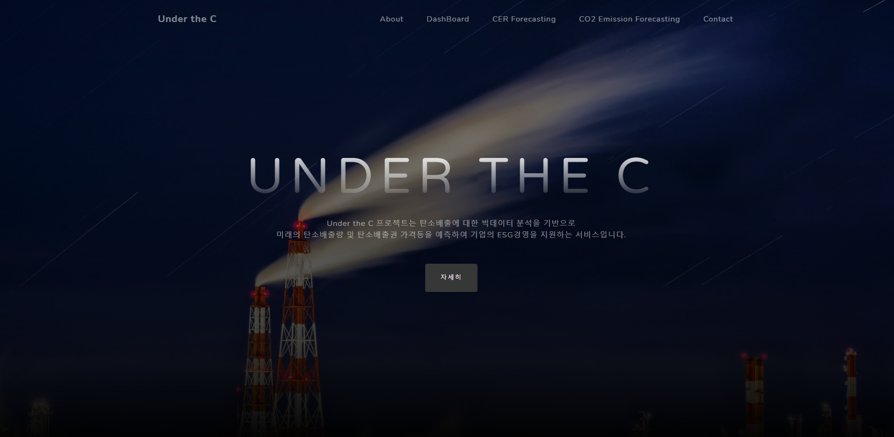
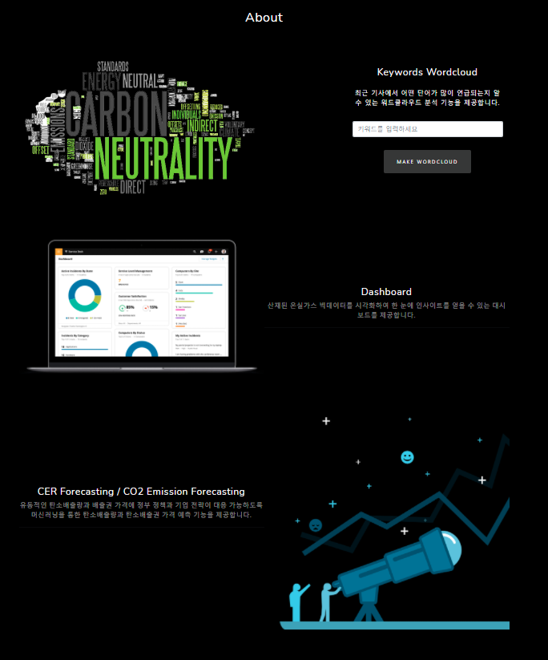
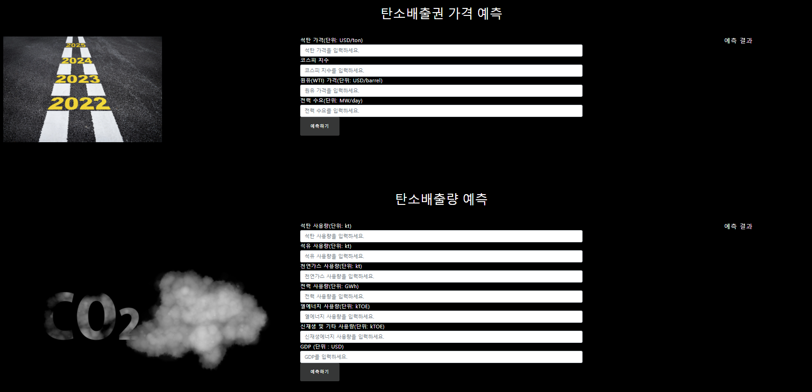
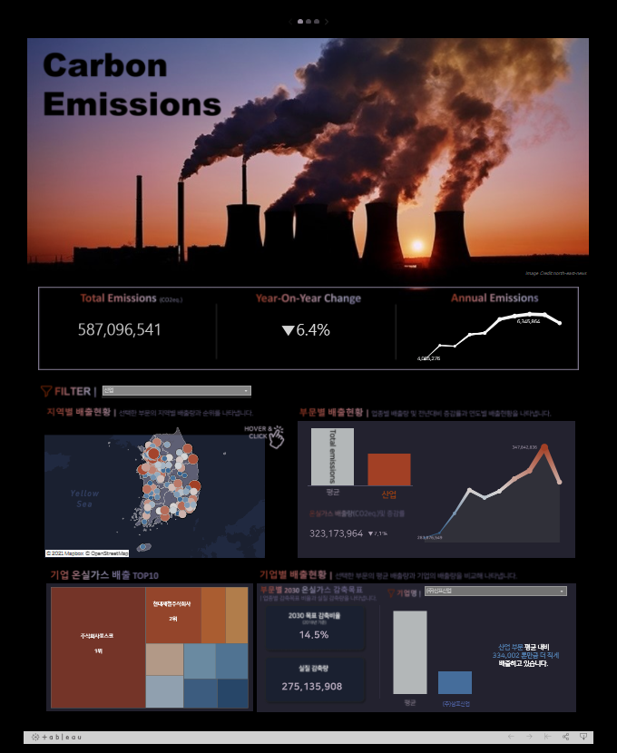
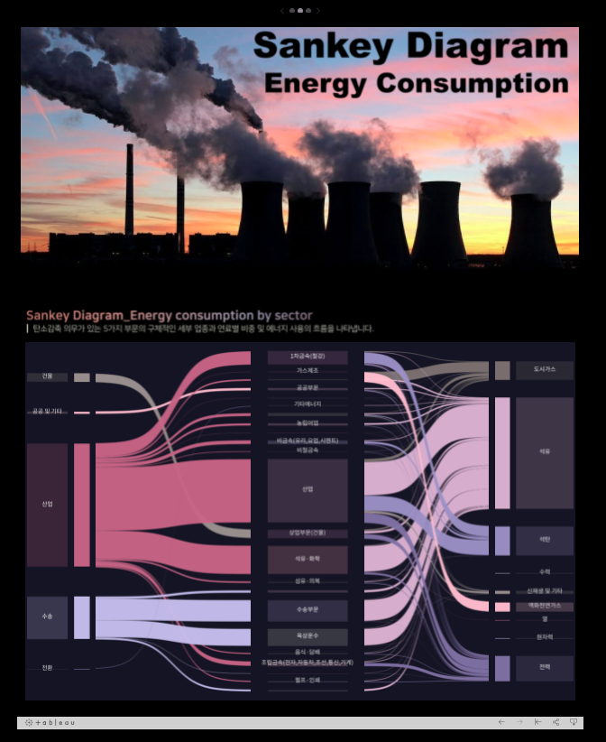
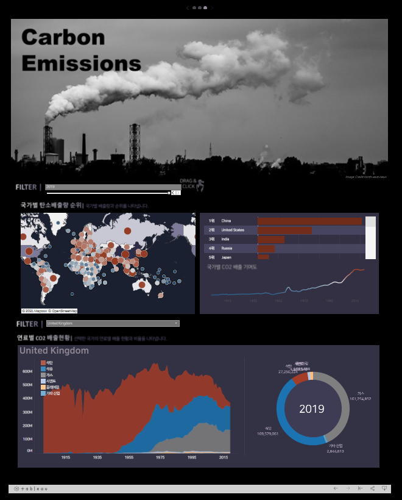

----
# 파이널 프로젝트 - Under the C

**탄소중립을 위한 빅데이터 분석과 예측**

> **본 프로젝트는 탄소배출에 대한 빅데이터 분석을 기반으로 
> 미래의 탄소배출량 및 탄소배출권 가격 등을 예측하여 기업의 ESG경영을 지원하기 위한 서비스**

> **탄소중립에 대한 인식 제고하고 인사이트를 주며, 정부의 정책 수립, 기업의 대응 전략에 활용할 수 있는 정보를 제공한다.**

평냉팀 : 김승윤 백지엽 오신옥 홍인표

## 시스템 구성도 

## 프로젝트 개요

## 탄소중립이란

## 프로젝트 제공 기능 3가지

### 탄소배출권 / 탄소배출량 예측

- 단변인 선형회귀 이용 ( 차후 업데이트(고도화) 필요 )

### 태블로 활용 대시보드 

- https://public.tableau.com/app/profile/.15743601

